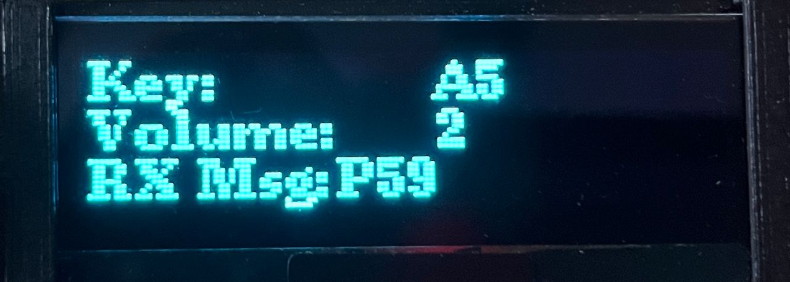
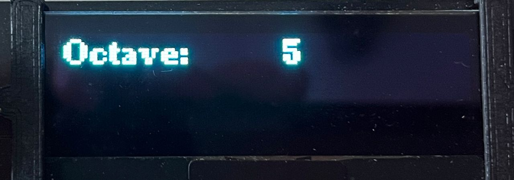
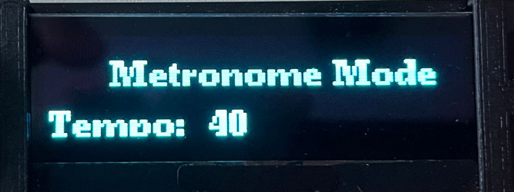

# Embedded Systems Coursework 2

## Contributors
- Yi Keat (Adrian) Khoo (CID: 02021759)
- Jungwon Bae (CID: 02032319)
- Keegan Lee (CID: 01892378)

## Table of Contents
1. [Introduction](#Introduction)
2. [Completed Core Functionalities](#completed-core-functionalities)
3. [Task Identification and Implementation](#task-identification-and-implementation)
	1. [FreeRTOS Tasks (Threads)](#freertos-tasks-threads)
	2. [Interrupt Service Routines (ISRs)](#interrupt-service-routines-isrs)
	3. [Knob Handling](#knob-handling)
	4. [Test Modes vs. Normal Operation](#test-modes-vs-normal-operation)
4. [Task Characterisation](#task-characterisation)
5. [Critical Instant Analysis](#critical-instant-analysis)
6. [Advanced Features](#advanced-features)

## Introduction
This GitHub repo serves as the submission for ES CW2. The full core functionality of the ES-SynthStarter has been implemented. In addition, advanced functionality and timing analyses are discussed below.

## Completed Core Functionalities

1. The synthesiser shall play the appropriate musical tone as a sawtooth wave when a key is pressed 
2. There shall be no perceptible delay between pressing a key and the tone starting 
3. There shall be a volume control with at least 8 increments, which shall be operated by turning a knob 
4. The OLED display shall show the name of the note being played and the current volume level
5. Every 100ms the OLED display shall refresh and an LED shall toggle
6. The synthesiser shall be configurable, during compilation or operation, to act as a sender module or receiver module.
7. If the synthesiser is configured as a sender, it shall send a message on the CAN bus whenever a key is pressed or released
8. If the synthesiser is configured as a receiver, it shall play a note or stop playing a note when it receives an appropriate message on the CAN bus

## Task Identification and Implementation

This section identifies all the tasks performed by the synthesiser system and specifies whether they are implemented as FreeRTOS threads (tasks) or as hardware interrupt service routines (ISRs).

### FreeRTOS Tasks (Threads)
| **Task Name**         | **Implementation**    | **Purpose** | **Location in Code** |
|----------------------|----------------------|-------------|---------------------|
| **scanKeysTask**     | FreeRTOS thread      | - Scans key matrix every 20 ms to detect key presses/releases.   - Updates rotary knob states.   - Shares input data with other tasks via a mutex. | `#if TEST_MODE == 0` |
| **metronomeTask**    | FreeRTOS thread      | - Runs every 50 ms to update metronome timing based on the tempo knob.   - Computes timer interval and updates metronome timer’s overflow. | `#if TEST_MODE == 0` |
| **displayUpdateTask** | FreeRTOS thread     | - Updates OLED display every 100 ms to show the current note/octave and volume level.   - Toggles an LED with each update. | `#if TEST_MODE != 2` |
| **CAN_TX_Task** (Sender Mode Only) | FreeRTOS thread | - Waits for key events on a message queue.   - Transmits CAN messages after acquiring a counting semaphore to ensure a transmit mailbox is available. | `#ifdef MODULE_MODE_SENDER`   `#if TEST_MODE == 0` |
| **decodeTask** (Receiver Mode Only) | FreeRTOS thread | - Processes incoming CAN messages from a queue.   - Triggers appropriate sound (start or release) based on received message. | `#ifdef MODULE_MODE_RECEIVER`   `#if TEST_MODE == 0` |

### Interrupt Service Routines (ISRs)
| **ISR Name**         | **Implementation**              | **Purpose** | **Location in Code** |
|----------------------|--------------------------------|-------------|---------------------|
| **sampleISR**       | Hardware Timer Interrupt      | - Executes at a high frequency to perform audio synthesis.   - Iterates through all active sounds, updating their ADSR envelope and phase accumulator.   - Computes the final audio sample and writes it to the output. | `#ifdef MODULE_MODE_RECEIVER`   `#if TEST_MODE == 0` |
| **metronomeISR**    | Hardware Timer Interrupt      | - Toggles the speaker output for the metronome at each timer overflow based on the metronome mode flag. | Defined immediately after `sampleISR()` |
| **myCanRxISR**      | CAN Receive Interrupt        | - Triggered when a CAN message is received.   - Reads the incoming message and places it on a FreeRTOS queue for processing by `decodeTask`. | Defined with `extern "C"` linkage under `#if TEST_MODE == 0` |
| **myCanTxISR**      | CAN Transmit Interrupt       | - Triggered upon completion of a CAN transmission.   - Releases a counting semaphore to signal that a transmit mailbox is available. | Defined with `extern "C"` linkage under `#if TEST_MODE == 0` |

### Knob Handling

- **Implementation:**  
  - The rotary knobs (for volume, octave, and tempo of metronome) are encapsulated within the `Knob` class.  
  - Their update logic is integrated into the key scanning routine (`scanKeysIteration()`), rather than implemented as separate tasks or ISRs.

### Test Modes vs. Normal Operation

- **Test Modes (`TEST_MODE ≠ 0`):**  
  - Threads are disabled (using `#define DISABLE_THREADS`) to enable isolated performance measurements of individual routines.
  
- **Normal Operation (`TEST_MODE = 0`):**  
  - All tasks and ISRs run concurrently under FreeRTOS.

## Task Characterisation

For each task, the following characterisation includes:

| **Task/Interrupt**                     | **Theoretical Minimum Initiation Interval** | **Measured Maximum Execution Time** |
|----------------------------------------|--------------------------------------------|------------------------------------|
| **scanKeysTask**                        | **20 ms**   **Assumption:** The key scanning routine is scheduled periodically using `vTaskDelayUntil` with a 20-ms delay. | **~101.6 µs per iteration** (from `TEST_MODE 1`) |
| **metronomeTask**                       | **50 ms**   **Assumption:** The metronome task is scheduled every 50 ms to update the metronome timing based on the tempo knob. | **~4.6 µs per iteration** (from `TEST_MODE 6`, ~146 µs total for 32 iterations) |
| **displayUpdateTask**                    | **100 ms**   **Assumption:** The OLED display is updated every 100 ms as determined by the task delay. | **~52 ms per iteration** (from `TEST_MODE 2`) |
| **CAN_TX_Task** (Sender Mode Only)       | **Event-driven:** Initiated immediately when a key event occurs, subject to CAN hardware and queue availability. | **~2.3 µs per iteration** (from `TEST_MODE 4`) |
| **decodeTask** (Receiver Mode Only)      | **Event-driven:** Triggered as soon as a CAN message is received, with negligible delay between events. | **~4 µs per iteration** (from `TEST_MODE 3`) |
| **sampleISR** (Sound Synthesis Interrupt) | **~45.45 µs**   **Assumption:** The hardware timer is configured for a 22 kHz sample rate (1/22000 ≈ 45.45 µs). | **~9 µs per iteration** (from `TEST_MODE 5`) |
| **Polyphony Stress Test** (TEST_MODE 7)  | **Event-driven:** Simulates rapid simultaneous activation of all voices. The minimum interval is limited by the key scan rate. | **~120.3 µs per iteration** (from `TEST_MODE 7`) |
| **Knob Response/Debounce Test** (TEST_MODE 8) | **Event simulation:** Based on the complete cycle of rotary knob state changes (e.g., 0b00 → 0b01 → 0b11 → 0b10). The minimum interval depends on hardware and debounce constraints. | **~23.4 µs per iteration** (from `TEST_MODE 8`) |

 
## Critical Instant Analysis

In a rate-monotonic system, the **critical instant** for a task occurs when it and all higher-priority tasks are initiated simultaneously. Under the following assumptions, deadlines are met if the worst-case response time of each task is less than or equal to its initiation interval (which we assume equals its deadline):

- **Single CPU:** Only one task runs at a time.
- **Fixed Initiation Interval ($\tau$):** Each task is initiated periodically with a fixed period that is also its deadline.
- **Fixed Task Priority:** Higher frequency tasks (shorter $\tau$) receive higher priority.
- **Negligible Overheads:** Context-switching and scheduling overheads are assumed to be minimal.

### System Tasks Under Analysis

For our synthesiser system, we consider the three main periodic tasks scheduled by FreeRTOS (using rate-monotonic scheduling):

1. **scanKeysTask**  
   - **Initiation Interval (τ₁):** 20 ms  
   - **Measured Execution Time (T₁):** ~101.6 µs  

2. **metronomeTask**  
   - **Initiation Interval (τ₂):** 50 ms  
   - **Measured Execution Time (T₂):** ~4.6 µs  

3. **displayUpdateTask**  
   - **Initiation Interval (τ₃):** 100 ms  
   - **Measured Execution Time (T₃):** ~52 ms  

These tasks are assigned priorities based on their periods (shorter period → higher priority). Thus, **scanKeysTask** has the highest priority, **metronomeTask** is next, and **displayUpdateTask** (the lowest priority) is our candidate for critical instant analysis.

### Worst-Case Response Time Calculation for the Lowest-Priority Task

For the lowest-priority task (displayUpdateTask), the worst-case response time $L_3$ is given by the sum of its own execution time plus the interference from all higher-priority tasks within its period:

$$L_3 = T_3 + \lceil \frac{\tau_3}{\tau_1} \rceil \times T_1 + \lceil \frac{\tau_3}{\tau_2} \rceil \times T_2$$

#### Calculation Steps:

1. **For scanKeysTask (T₁):**  
   $$\frac{\tau_3}{\tau_1} = \frac{100 \, \text{ms}}{20 \, \text{ms}} = 5$$
   
   Thus, there are 5 instances of scanKeysTask in 100 ms.  
   
   Total interference from scanKeysTask:  
   $$ 5 \times 101.6 \, \mu s = 508 \, \mu s $$

2. **For metronomeTask (T₂):**  
   $$\frac{\tau_3}{\tau_2} = \frac{100 \, \text{ms}}{50 \, \text{ms}} = 2$$
   Total interference from metronomeTask:  
   $$ 2 \times 4.6 \, \mu s = 9.2 \, \mu s $$

3. **For displayUpdateTask (T₃):**  
   $$ T_3 \approx 52 \, \text{ms} $$

So, the worst-case response time for displayUpdateTask is:

$$L_3 = 52 \, \text{ms} + 0.508 \, \text{ms} + 0.0092 \, \text{ms} \approx 52.5172 \, \text{ms}$$

Since $L_3 \approx 52.52 ms$ is less than the task’s deadline of 100 ms (its initiation interval), the `displayUpdateTask` will always complete before its deadline under worst-case conditions.

### Analysis of Other Tasks

- **scanKeysTask:**  
  As the highest priority task, its worst-case response time is simply its execution time $T_1 \approx 101.6 \, \mu s$, which is far below its 20 ms period.

- **metronomeTask:**  
  The worst-case response time for metronomeTask includes interference from scanKeysTask.  
  $\lceil \frac{50 \, \text{ms}}{20 \, \text{ms}} \rceil = \lceil 2.5 \rceil = 3$ instances of scanKeysTask.  
  Thus,  
  $$L_2 = T_2 + 3 \times T_1 = 4.6 \, \mu s + 3 \times 101.6 \, \mu s \approx 309.4 \, \mu s $$
  This is well below its 50 ms deadline.

### Conclusion

By performing a critical instant analysis using the measured execution times and the configured initiation intervals, we have shown that:

- **scanKeysTask** meets its deadline (20 ms) with a worst-case response time of ~101.6 µs.
- **metronomeTask** meets its deadline (50 ms) with a worst-case response time of ~309.4 µs.
- **displayUpdateTask** meets its deadline (100 ms) with a worst-case response time of ~52.52 ms.

Thus, under worst-case conditions, all deadlines are met according to the rate-monotonic scheduling analysis.

>[!IMPORTANT]
>Things to add:
>1. An identification of all the tasks that are performed by the system with their method of implementation: thread or interrupt
>2. A characterisation of each task with its theoretical minimum initiation interval (including assumptions used) and measured maximum execution time
>3. A critical instant analysis of the rate monotonic scheduler, showing that all deadlines are met under worst-case conditions
>4. A quantification of total CPU utilisation
>5. An identification of all the shared data structures and the methods used to guarantee safe access and synchronisation
>6. An analysis of inter-task blocking dependencies that shows any possibility of deadlock

## Advanced Features
1. Octave Tuning
2. Polyphony
3. ASDR Envelope
4. Metronome Functionality

### Octave Tuning

Octave tuning in this synthesizer lets the user dynamically shift the pitch range of the instrument by selecting a different octave through a dedicated knob (`knob2`). Changing the octave is done by toggling the `knob2` button which prompts the user with a display of the current octave. Working on the basic step approach from the core lab, the code adjusts these step sizes by shifting them right depending on how far the knob is turned from the default value of 1. 

### Polyphony
Each key press is treated as an independent "voice" with its own state, which includes frequency, phase, and the dedicated ADSR envelope. When a key is pressed, a free voice is allocated (or an existing one is re-triggered), and its parameters are set based on the note and octave. The sample ISR then iterates over all active voices, updating each one's envelope and phase accumulator before summing their outputs to generate the final sound. In this way, the dynamic characteristics of each note such as the ADSR phases, allow for a more layered audio output.

### ADSR Envelope
The Attack Develope Sustain Release (ASDR) envelope. Each stage of the envelope controls a different aspect of the sound's dynamics:
- Attack (A): The time taken for the sound to reach its peak volume after a key is pressed. A short attack results in an immediate sound, while a long attack creates a gradual buildup.
- Decay (D): The time taken for the sound to decrease from its peak to the sustain level. Short decay times create a sharp drop-off, while longer times make the transition smoother.
- Sustain (S): The constant volume level maintained as long as the key is held down. Unlike the other parameters, sustain is a level rather than a time-based value.
- Release (R): The time it takes for the sound to fade out completely after the key is released. A short release results in an abrupt stop, while a longer release allows the sound to decay gradually.
By tuning the parameters of each stage, the sound emitted can be changed from a flat single tone, to have a dynamic fade in and fade out when a key is pressed.

### Metronome Functionality

The metronome mode  allows the user to keep time while using keyboad. The metronome is toggled by depressing the `knob0` button at which point the display changes from the default into metronome mode. This mode periodically plays an audible 'click' sound where the tempo is adjustable between 40 and 240 bpm, to cover the range of tempos which a musician might use. 

- **Metronome Task (Thread):**  
  This thread runs periodically (every 50 ms) to read the tempo knob and update the metronome timer’s overflow period. Since adjusting the timer based on user input is not as time-critical, it can run as a lower-priority task without interfering with sound generation.

- **Metronome ISR:**  
  This is a high-priority, time-critical routine that is triggered by the timer overflow. Its sole job is to toggle the output (e.g., drive a speaker) to generate the metronome sound. Because ISRs are designed to execute quickly, they ensure that the sound is generated with minimal delay.

By separating these concerns, the system can update the tempo asynchronously while ensuring that the sound generation remains real-time and responsive.
